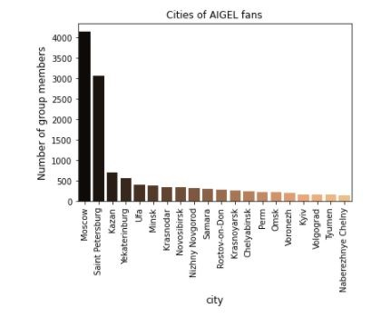
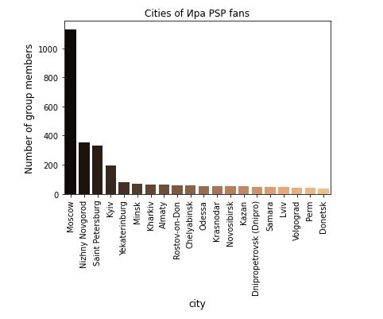
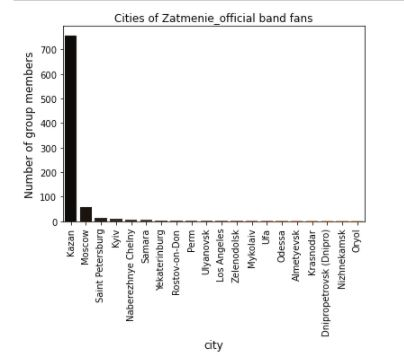
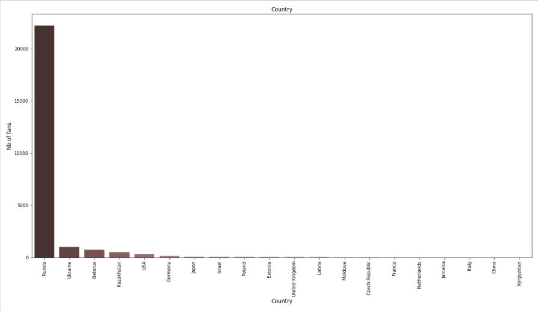
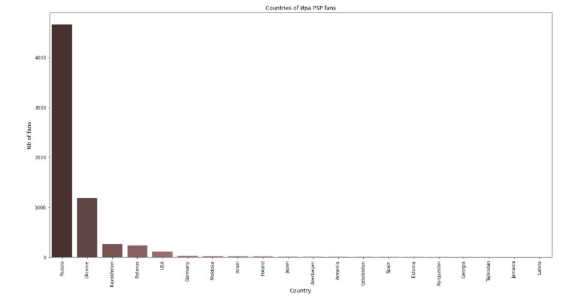
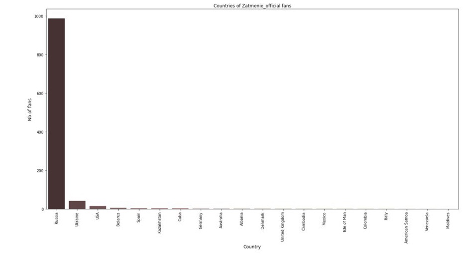

# Название

## Цели, задачи

*Мы посмотрели как распределяется аудитория каждой нашей группы по городам* 

*Также мы проанализировали в каких странах слушают данные группы, составив графики распределения участников по странам*

# Выводы
