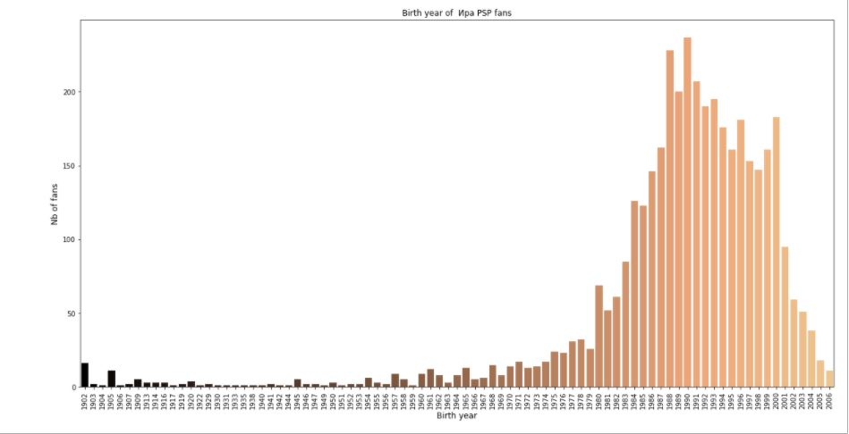
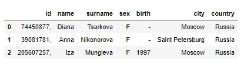

# Развитие хип-хоп культуры в республике Татарстан и Нижегородской области 

## Задачи проекта 

1. Взять три базирующиеся в данных регионах группы, которые на наш взгляд наиболее популярные (АИГЕЛ, Затмение, Ира PSP) 
2. Анализ аудитории каждого паблика (определяем возрастную аудиторию, выявляем географическое положение, показываем гендерное соотношение) 
3. Сравнение аудитории трех пабликов на предмет места проживания, возраста и гендера
4. Выявить пересекающуюся аудиторию в трёх пабликах
5. Анализ постов каждого паблика на предмет активности проведения концертов 
6. Визуализировать полученную информацию 

## Анализ аудитории

* *по месту проживания*
   - страна
   

   - город
   

* *по возрасту*

* *по гендерному признаку*

* *вовлеченность из городов Москва,Казань VS остальные города*

## Вывод 1. 

### Проанализировав аудиторию по месту проживания (город, страна), по возрасту, и гендерному признаку, можно сделать следующие выводы:
1. Во всех трех случаях больший процент аудитории проживает в России и в Украине. Хотя жители России гораздо превалируют, в любом случае
2. Переходя конкретно к городам, можно заметить, что большая вовлечнность аудитории наблюдается из Москвы, Санкт-Петербурга и Казани, однако в каждом случае по-разному. Так, например, наибольшее количество подписчиков "Aigel" из Москвы (потом Санкт-Петербург, Казань). У "Ira_psp" больше всего фанатов также их Москвы, но следом идут подписчики из Нижнего Новгорода (их примерно столько же, сколько и из СПб). Стоит заметить, что процент подписчиков из Казани, в данном случае, очень мал. И наконец, подписчики "Zatmenie_official" почти все из Казани. 
3. Возрастная аудитория также разная. Самые молодые слушают Aigel, далее Ira_psp, и следом Zatmenie. Стоит отметить, что поколение 2000-х гг. уже не очень вовлечено в прослушивание данных исполнителей, особенно Zatmenie.
4. ГЕНДЕР
5. Соотношение участников из двух крупных городов таких как Москва и Казань намного меньше количества участников из провинции. Это показывает, что в провинции эта музыка пользуется большей популярностью. Да, из предыдущих графиков отдельно по городам, получался иной вывод. Однако, если сложить участников не из крупных городов всех вместе, то получится, что по численности их больше.

## Анализ пересечения аудитории из трех групп

## Вывод 2.

Только мы подписаны на все три группы сразу. Это объясняется нашей заинтересованностью в выполнении домашнего задания, и дабы полностью погрузиться в процесс, мы втроем подписались на исследуемые нами группы :) В остальном, можно сделать вывод, что аудитории трех групп никак не смешиваются между собой. 

## Анализ постов каждого паблика на предмет активности проведения концертов 

Концертов у Aigel: 319
Концертов у Иры PSP: 327
Концертов у Zatmenie_official: 24

## Вывод 3.

С помощью регулярных выражений, мы посчитали сколько раз слово "концерт" было упомянуто в выгруженных постах. Оказалось, что больше активности в концертном плане проявляет Ira Psp. С небольшим отрывом - Aigel. И всего 24 упоминания слово концерт у Zatmenie_official

