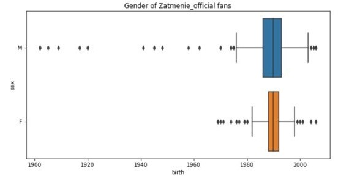

# Развитие хип-хоп культуры в республике Татарстан и Нижегородской области 

## Задачи проекта 

1. Взять три базирующиеся в данных регионах группы, которые на наш взгляд наиболее популярные (АИГЕЛ, Затмение, Ира PSP) 
2. Анализ аудитории каждого паблика (определяем возрастную аудиторию, выявляем географическое положение, показываем гендерное соотношение) 
3. Анализ постов каждого паблика на предмет частоты публикаций и активности проведения концертов 
4. Сравнение аудитории трех пабликов на предмет места проживания, возраста и гендера 
5. Выявить пересекающуюся аудиторию в трёх пабликах
6. Визуализировать полученную информацию 

### Анализ аудитории

* *по месту проживания*
   - страна
   

   - город
   

* *по возрасту*

* *по гендерному признаку*

# Выводы по 1 пункту

## Исходя из 
